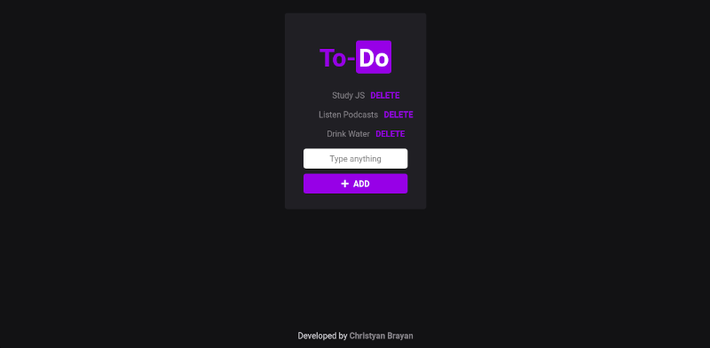

[](https://christyanbrayan.github.io/to-do)

<p align="center">
  

  

  

  <br>
  

</p>

# Indice

- :rocket: [Sobre o Projeto](#rocket-sobre-o-projeto)
- 👨‍💻️ [Tecnogias utilizadas](#%EF%B8%8F-tecnogias-utilizadas)
- 📦️ [Como utilizar o projeto](#%EF%B8%8F-como-utilizar-o-projeto)

---

## :rocket: Sobre o Projeto

O **To-do**  foi desenvolvido em HTML5, CSS3 e JavaScript [JS Starter Course](https://app.rocketseat.com.br/node/curso-java-script) of [Rocketseat](https://rocketseat.com.br/), por [Diego Fernandes](https://github.com/diego3g)

---

## 👨‍💻️ Tecnogias utilizadas

O projeto foi desenvolvido utilizando as seguintes tecnologias:

- HTML5;
- CSS3;
- JavaScript;
- CSS reset by [Normalize.css](https://necolas.github.io/normalize.css/);

### Dependências

- Icons by [Font Awesome](https://fontawesome.com/);
- Fonts by [Google Fonts](https://fonts.google.com)
- Hospeded with [GitHub Pages](https://pages.github.com/);

The design was based on [Rocketseat Website](https://app.rocketseat.com.br)

Acess [here](https://christyanbrayan.github.io/to-do)!

### IDE

  - [Visual Studio Code](https://code.visualstudio.com/)

---
## 📦️ Como utilizar o projeto

Para copiar o projeto, utilize os comandos:

```bash
  # Clonar o repositório
  ❯ git clone  https://github.com/christyanbrayan/to-do

  # Entrar no diretório
  ❯ cd to-do

  ``` 

### Contributors
- [@flubyGit](https://github.com/flubyGit)
- [@lucianesantcs](https://github.com/lucianesantcs)
- [@SiqueiraDev](https://github.com/siqueiradev)

Licensed by [MIT](LICENSE)

Also want contribute with anything? Open an [issue](https://github.com/christyanbrayan/to-do/issues/new) or [PR](https://github.com/christyanbrayan/to-do/pulls)!

---